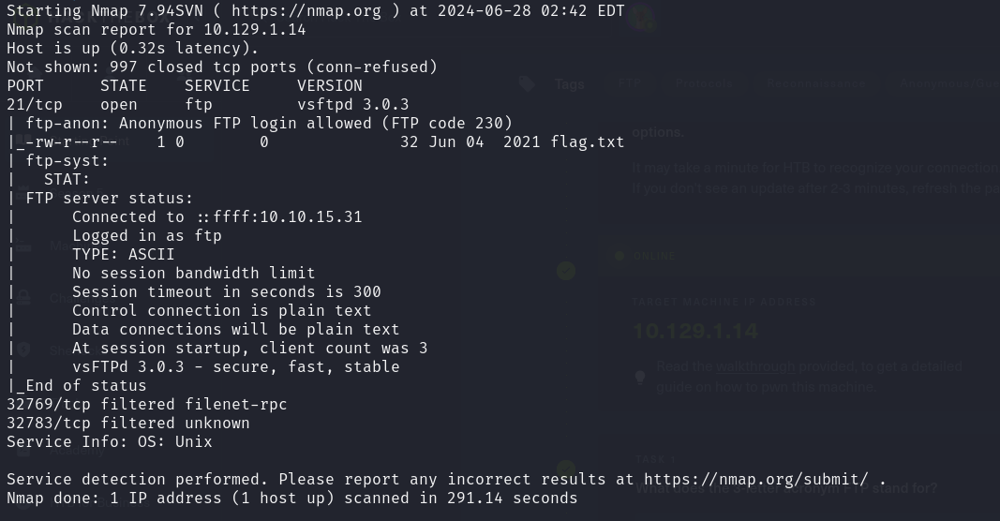
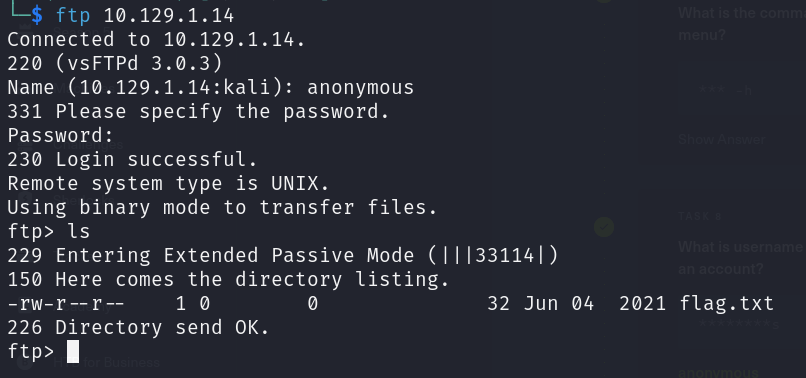
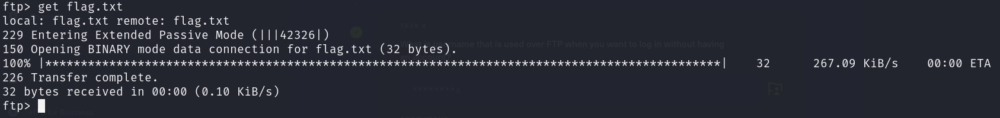

# FAWN

STARTING POINT - TIER 0

## Enumeration

**Nmap scan**

```bash
nmap -sC -sV 10.129.1.14
```



## Exploitation

**Connect to FTP Server**

```bash
ftp 10.129.1.14
```

**Login without having an account**

- `anonymous`

**List all contents**

```bash
ls
```



**Download the file**

```bash
get flag.txt
```



**Exit FTP Server and get flag**

```bash
cat flag.txt
```
