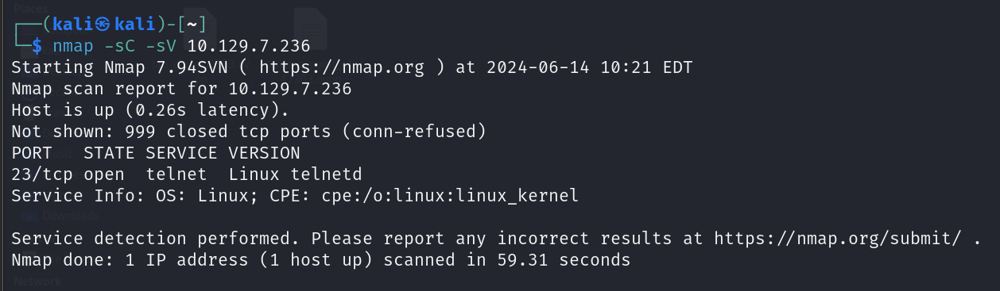
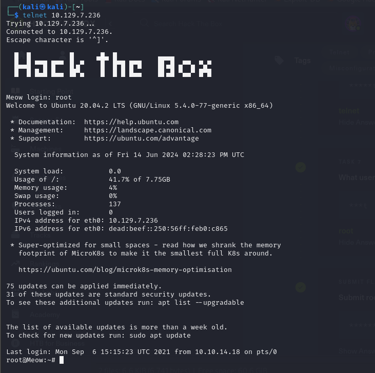
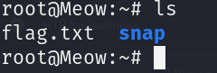

# MEOW

STARTING POINT - TIER 0

## Enumeration

**Nmap scan**

```bash
nmap -sC -sV 10.129.7.236
```



## Exploitation

**Connect to Telnet Server**

```bash
telnet 10.129.7.236
```



**list all contents**

```bash
ls
```



**Get flag**

```bash
cat flag.txt
```
